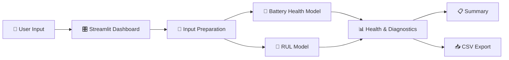

<div align="center">

# 🔋 EV Battery AI Prediction

### Predictive intelligence for cleaner, longer-lasting electric mobility.

<p>
  <a href="https://evhealthprediction.streamlit.app/">
    
  </a>
  
  
  
</p>

<p>
  <b>⚡ Battery Health</b> &nbsp; • &nbsp;
  <b>⏳ Remaining Useful Life</b> &nbsp; • &nbsp;
  <b>📊 Battery Diagnostics</b> &nbsp; • &nbsp;
  <b>📥 CSV Reports</b>
</p>

</div>

---

<div align="center">


</div>

## 🌐 Live Application

> **Try the deployed application:**  
> **https://evhealthprediction.streamlit.app/**

The application is built as an interactive Streamlit dashboard where users can enter an EV battery operating profile and generate a battery-health analysis.

---

## ✨ What This Project Does

**EV Battery AI Prediction** is a machine-learning powered dashboard designed to estimate important battery condition indicators from operational and usage data.

The application accepts battery, temperature, driving, charging, and efficiency-related inputs and produces an interactive analysis containing:

- 🔋 **Battery Health (%)**
- ⏳ **Remaining Useful Life (cycles)**
- ⚡ **Efficiency Score**
- 🛡️ **Battery Risk**
- 🌡️ **Thermal Stress**
- 🔌 **Charging Stress**
- 🚗 **Driving Load**
- 🧭 **Battery Performance Profile**
- 📋 **Prediction Summary**
- 📥 **Downloadable CSV analysis**

---

## 🚀 Key Features

| Feature | Description |
|---|---|
| 🔋 Battery Health Prediction | Estimates the current battery health on a 0–100% scale |
| ⏳ RUL Prediction | Estimates remaining useful life in charging/usage cycles |
| ⚡ Efficiency Analysis | Provides an efficiency score for the entered battery profile |
| 🛡️ Risk Analysis | Presents a battery-risk indicator |
| 🌡️ Thermal Diagnostics | Evaluates temperature-related battery stress |
| 🔌 Charging Diagnostics | Calculates charging-related stress |
| 🚗 Driving Analysis | Evaluates driving-load characteristics |
| 📊 Interactive Visuals | Uses Plotly gauges and diagnostic visualizations |
| 🧭 Radar Profile | Shows a multi-dimensional battery performance profile |
| 📋 Summary Table | Displays the main prediction results in one place |
| 📥 CSV Export | Downloads the complete analysis as a CSV file |
| 💻 Responsive UI | Wide Streamlit dashboard with grouped input sections |

---

## 🧠 Input Parameters

The dashboard organizes the input profile into three main areas.

### 🔋 Battery Condition

- Battery Age (Months)
- Charging Cycles
- Depth of Discharge (%)
- Average Discharge Rate (%)
- Operating Hours

### 🌡️ Temperature & Driving

- Average Temperature (°C)
- Maximum Temperature (°C)
- Daily Driving Distance (KM)
- Average Speed (KM/H)
- Regenerative Braking Usage (%)

### ⚡ Charging & Efficiency

The dashboard also includes charging and efficiency-related variables from the project dataset to capture the wider operating profile.

---

## 📊 Dashboard Output

After clicking **Analyze Battery**, the application generates four headline metrics:

```text
┌──────────────────┬──────────────────────┬──────────────────┬─────────────────┐
│ 🔋 Battery Health│ ⏳ Remaining Useful  │ ⚡ Efficiency    │ 🛡️ Battery Risk│
│                  │    Life              │                  │                 │
└──────────────────┴──────────────────────┴──────────────────┴─────────────────┘
```

The application also classifies battery condition as:

- 🟢 **Excellent** — health ≥ 80%
- 🟡 **Moderate** — health between 60% and 79.99%
- 🔴 **Poor** — health < 60%

> These status thresholds are implemented directly in the Streamlit application.

---

## 🏗️ Project Architecture



---

## 🗂️ Repository Structure

```text
EV-Battery-Health-prediction/
│
├── app.py
├── best_battery_health_model.pkl
├── best_rul_model.pkl
├── ev_battery_prediction_dataset.csv
├── logo.png
├── requirements.txt
├── README.md
│
└── assets/
    └── (optional project screenshots)
```

### File Overview

| File | Purpose |
|---|---|
| `app.py` | Streamlit application and prediction dashboard |
| `best_battery_health_model.pkl` | Saved battery-health prediction model |
| `best_rul_model.pkl` | Saved remaining-useful-life model |
| `ev_battery_prediction_dataset.csv` | Dataset used by the application |
| `logo.png` | Dashboard branding asset |
| `requirements.txt` | Python dependencies |
| `assets/ev-battery-ai.gif` | Animated README hero graphic |

---

## 🛠️ Tech Stack

<p>
  
  
  
  
  
  
  
  
</p>

---

## ⚙️ How It Works

### 1. Enter Battery Profile
The user adjusts the battery's operating and usage parameters in the Streamlit interface.

### 2. Prepare Inputs
The application converts the entered values into the feature format expected by the saved models.

### 3. Generate Predictions
Two saved machine-learning models are loaded with `joblib`:

- `best_battery_health_model.pkl`
- `best_rul_model.pkl`

### 4. Calculate Diagnostics
The dashboard combines the model predictions with calculated diagnostic indicators such as efficiency, thermal stress, charging stress, driving load, and battery risk.

### 5. Visualize Results
Plotly visualizations present the results through gauges and a battery performance profile.

### 6. Export Results
The user can download an analysis summary as:

```text
ev_battery_analysis_summary.csv
```

---

## ▶️ Run Locally

### Clone the repository

```bash
git clone https://github.com/Kumaresh2005/EV-Battery-Health-prediction.git
cd EV-Battery-Health-prediction
```

### Create a virtual environment

```bash
python -m venv venv
```

### Activate it

**Windows:**

```bash
venv\Scripts\activate
```

**macOS / Linux:**

```bash
source venv/bin/activate
```

### Install dependencies

```bash
pip install -r requirements.txt
```

### Start Streamlit

```bash
streamlit run app.py
```

The application will open locally in your browser.

---

## ☁️ Deployment

This project is deployed using **Streamlit Community Cloud**.

### Deployment flow

```text
GitHub Repository
       ↓
requirements.txt
       ↓
Streamlit Community Cloud
       ↓
app.py
       ↓
Live EV Battery AI Dashboard
```

🚀 **Live App:** https://evhealthprediction.streamlit.app/

---

## 📌 Why This Project Is Useful

EV batteries gradually degrade due to usage patterns, charging behavior, thermal conditions, and operating conditions.

A predictive dashboard can help turn raw operating data into an easier-to-understand battery condition report.

This project demonstrates an end-to-end data-science workflow:

```text
Dataset
   ↓
Data Preparation
   ↓
Machine Learning
   ↓
Saved Models
   ↓
Streamlit Application
   ↓
Interactive Predictions
   ↓
Visual Analytics
   ↓
Deploy to Cloud
```

---

## 🎯 Project Highlights

- ✅ End-to-end ML project
- ✅ Regression-based prediction workflow
- ✅ Two saved prediction models
- ✅ Interactive Streamlit interface
- ✅ Plotly visual analytics
- ✅ Battery-health classification logic
- ✅ Diagnostic scoring
- ✅ CSV report download
- ✅ Cloud deployment
- ✅ GitHub-ready project structure

---

## 🔮 Future Improvements

Potential next steps for the project:

- [ ] Add SHAP-based model explainability
- [ ] Add feature-importance visualization
- [ ] Add historical battery trend prediction
- [ ] Add model confidence / prediction intervals
- [ ] Add database-backed prediction history
- [ ] Add authentication for private dashboards
- [ ] Add automated model retraining
- [ ] Add real EV/BMS sensor integration
- [ ] Add downloadable PDF reports
- [ ] Add monitoring and model-performance tracking

---

## ⚠️ Disclaimer

This project is intended for **educational and demonstration purposes**.

Predictions should not be treated as a substitute for professional EV battery diagnostics, manufacturer specifications, battery-management-system data, or safety inspections.

---

## 👨‍💻 Author

**Kumaresh Biswas**

Machine Learning • Data Science • Python • Streamlit

---

<div align="center">

### 🔋 Predict smarter. Drive longer. Build cleaner.

**If you find this project useful, consider giving the repository a ⭐**

</div>
